# WMS Project Architecture - Interactive Diagrams

View these diagrams in VS Code with **Markdown Preview Mermaid Support** extension.

---

## 📊 System Architecture Overview


---

## 🔄 Document Posting Flow (ACID Transaction)

```mermaid
sequenceDiagram
    participant Client
    participant API
    participant DocService
    participant Session
    participant WhRepo
    participant InvRepo
    participant DB
    
    Client->>API: POST /documents/{id}/post
    API->>DocService: post_document(id, user)
    
    Note over DocService: Validate document exists
    DocService->>DocService: _get_document_for_processing()
    
    Note over DocService,DB: START TRANSACTION
    DocService->>WhRepo: set_auto_commit(False)
    DocService->>InvRepo: set_auto_commit(False)
    
    alt Import Document
        DocService->>WhRepo: add_product_to_warehouse()
        WhRepo-->>DocService: OK (no commit)
        DocService->>InvRepo: add_quantity()
        InvRepo-->>DocService: OK (no commit)
    else Export Document
        DocService->>WhRepo: remove_product_from_warehouse()
        WhRepo-->>DocService: OK (no commit)
        DocService->>InvRepo: remove_quantity()
        InvRepo-->>DocService: OK (no commit)
    else Transfer Document
        DocService->>WhRepo: remove_product (source)
        WhRepo-->>DocService: OK (no commit)
        DocService->>WhRepo: add_product (dest)
        WhRepo-->>DocService: OK (no commit)
    end
    
    DocService->>DocService: update document status
    
    alt All Operations Successful
        DocService->>Session: commit()
        Session->>DB: COMMIT TRANSACTION
        DB-->>Session: Success
        Note over DocService,DB: ✅ All changes committed atomically
        DocService-->>API: Document Posted
        API-->>Client: 200 OK
    else Any Operation Failed
        DocService->>Session: rollback()
        Session->>DB: ROLLBACK TRANSACTION
        DB-->>Session: Rolled back
        Note over DocService,DB: ❌ All changes reverted
        DocService-->>API: Error
        API-->>Client: 400/500 Error
    end
    
    DocService->>WhRepo: set_auto_commit(True)
    DocService->>InvRepo: set_auto_commit(True)
```



---

## 🗂️ Database Schema & Indexes

```mermaid
erDiagram
    PRODUCTS ||--o{ WAREHOUSE_INVENTORY : contains
    PRODUCTS ||--o| INVENTORY : tracks
    PRODUCTS ||--o{ DOCUMENT_ITEMS : includes
    WAREHOUSES ||--o{ WAREHOUSE_INVENTORY : stores
    WAREHOUSES ||--o{ DOCUMENTS : from
    WAREHOUSES ||--o{ DOCUMENTS : to
    DOCUMENTS ||--|{ DOCUMENT_ITEMS : contains
    
    PRODUCTS {
        int product_id PK "Primary Key"
        string name "Indexed"
        string description
        float price "CHECK >= 0"
    }
    
    WAREHOUSES {
        int warehouse_id PK "Primary Key"
        string location "Unique, Indexed"
    }
    
    INVENTORY {
        int product_id PK "FK to products"
        int quantity "CHECK >= 0"
    }
    
    WAREHOUSE_INVENTORY {
        int id PK "Primary Key"
        int warehouse_id FK "Indexed"
        int product_id FK "Indexed"
        int quantity "CHECK >= 0"
    }
    
    DOCUMENTS {
        int document_id PK "Primary Key"
        string doc_type "Indexed"
        string status "Indexed"
        int from_warehouse_id FK "Indexed"
        int to_warehouse_id FK "Indexed"
        string created_by "Indexed"
        datetime created_at "Indexed"
        datetime posted_at "Indexed"
    }
    
    DOCUMENT_ITEMS {
        int id PK "Primary Key"
        int document_id FK
        int product_id FK
        int quantity
        float unit_price
    }
```

**Critical Indexes:**
- `ix_products_name` - Product searches
- `ix_documents_status_created_at` - Status filtering
- `ix_documents_type_status` - Type + status queries
- `ix_warehouse_inventory_warehouse_product` - Inventory lookups

---

## 🏗️ Clean Architecture Layers

```mermaid
graph TB
    subgraph "🌐 External Layer"
        HTTP[HTTP Requests]
        DB[(Database)]
        Logs[Log Files]
    end
    
    subgraph "🔌 API Layer - Interface Adapters"
        FastAPI[FastAPI App]
        Routers[API Routers]
        Schemas[Pydantic Schemas]
        Middleware[Middleware Stack]
        Dependencies[Dependency Injection]
    end
    
    subgraph "💼 Application Layer - Use Cases"
        ProdSvc[Product Service]
        WhSvc[Warehouse Service]
        InvSvc[Inventory Service]
        DocSvc[Document Service]
        RepSvc[Report Service]
    end
    
    subgraph "🎯 Domain Layer - Business Logic"
        Product[Product Entity]
        Warehouse[Warehouse Entity]
        Inventory[Inventory Entity]
        Document[Document Entity]
        Validation[Domain Validation]
        Rules[Business Rules]
    end
    
    subgraph "💾 Infrastructure Layer - Data Access"
        Interfaces[Repository Interfaces]
        SQLRepos[SQL Repositories]
        Models[SQLAlchemy Models]
        Transaction[Transaction Manager]
        ConnPool[Connection Pool]
    end
    
    HTTP --> FastAPI
    FastAPI --> Middleware
    FastAPI --> Routers
    Routers --> Schemas
    Routers --> Dependencies
    
    Dependencies --> ProdSvc
    Dependencies --> WhSvc
    Dependencies --> InvSvc
    Dependencies --> DocSvc
    Dependencies --> RepSvc
    
    ProdSvc --> Product
    WhSvc --> Warehouse
    InvSvc --> Inventory
    DocSvc --> Document
    
    Product --> Validation
    Warehouse --> Validation
    Inventory --> Validation
    Document --> Validation
    Document --> Rules
    
    ProdSvc --> Interfaces
    WhSvc --> Interfaces
    InvSvc --> Interfaces
    DocSvc --> Interfaces
    
    Interfaces --> SQLRepos
    SQLRepos --> Models
    SQLRepos --> Transaction
    Models --> ConnPool
    ConnPool --> DB
    
    Middleware -.-> Logs
    ProdSvc -.-> Logs
    WhSvc -.-> Logs
    InvSvc -.-> Logs
    DocSvc -.-> Logs
    
    style FastAPI fill:#4CAF50,stroke:#2E7D32,color:#fff
    style Product fill:#2196F3,stroke:#1565C0,color:#fff
    style Document fill:#2196F3,stroke:#1565C0,color:#fff
    style DB fill:#FF9800,stroke:#E65100,color:#fff
    style Transaction fill:#E91E63,stroke:#880E4F,color:#fff
    style Rules fill:#9C27B0,stroke:#4A148C,color:#fff
```



**Layer Responsibilities:**
- **API**: HTTP handling, validation, serialization
- **Application**: Use case orchestration, transaction management
- **Domain**: Business logic, validation rules, entities
- **Infrastructure**: Database access, external systems

---

## 🔐 Request Lifecycle with Security


---

## 📦 Project File Structure


---

## 🔄 Data Flow: Create Import Document


---

## 📈 Performance: Database Index Impact

```mermaid
graph TD
    subgraph "Query: Get Draft Documents"
        Query1[SELECT * FROM documents<br/>WHERE status = 'DRAFT']
    end
    
    subgraph "Without Index"
        FullScan[Full Table Scan]
        Read1M[Read 1,000,000 rows]
        Filter[Filter in memory]
        Return1K[Return 1,000 rows]
        Time500[⏱️ 500ms]
        
        Query1 --> FullScan
        FullScan --> Read1M
        Read1M --> Filter
        Filter --> Return1K
        Return1K --> Time500
    end
    
    subgraph "With Index: ix_documents_status"
        IndexLookup[Index Lookup]
        Read1K[Read 1,000 rows directly]
        ReturnFast[Return 1,000 rows]
        Time5[⏱️ 5ms]
        
        Query1 --> IndexLookup
        IndexLookup --> Read1K
        Read1K --> ReturnFast
        ReturnFast --> Time5
    end
    
    Time500 -.->|100x slower| Comparison
    Time5 -.->|100x faster| Comparison[Performance Comparison]
    
    style Time500 fill:#F44336,stroke:#B71C1C,color:#fff
    style Time5 fill:#4CAF50,stroke:#2E7D32,color:#fff
    style Comparison fill:#2196F3,stroke:#1565C0,color:#fff
```



---

## 🛡️ Security Architecture


---

## 🎯 How to View These Diagrams

### Method 1: VS Code (Recommended)
1. Install extension: **Markdown Preview Mermaid Support**
   ```bash
   code --install-extension bierner.markdown-mermaid
   ```

2. Open this file in VS Code

3. Press `Ctrl+Shift+V` (Windows) or `Cmd+Shift+V` (Mac)

4. See beautiful interactive diagrams! ✨

### Method 2: GitHub
- Push this file to GitHub
- GitHub natively renders Mermaid diagrams

### Method 3: Online Viewer
- Copy diagram code
- Paste at https://mermaid.live/
- Export as PNG/SVG

---

## 📚 Diagram Legend

**Colors:**
- 🟢 Green: Entry points, success paths
- 🔵 Blue: Core business logic
- 🟠 Orange: Database/storage
- 🔴 Red: Error states, security
- 🟣 Purple: Logging, monitoring
- 🟣 Pink: Transaction management

**Arrows:**
- `-->` Solid: Direct dependency
- `-.->` Dashed: Logging/monitoring
- `==>` Thick: Critical path

---

## 🚀 Interactive Exploration

**Try these in VS Code:**

1. **Zoom**: Mouse wheel in diagram preview
2. **Pan**: Click and drag
3. **Export**: Right-click → Export as PNG
4. **Edit**: Modify diagram code, see live preview

**Useful for:**
- 📖 Onboarding new developers
- 🎓 System documentation
- 🐛 Debugging complex flows
- 🏗️ Architecture planning

code --install-extension bierner.markdown-mermaid
Ctrl+Shift+V